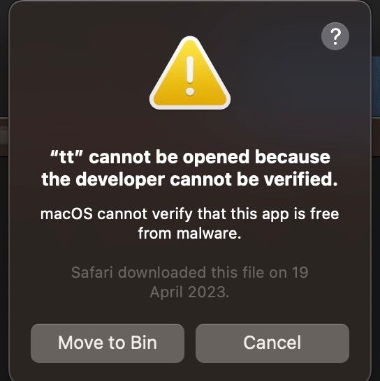

<a href="http://tarantool.org">
  
</a>

# Tarantool CLI

[![Go Reference][godoc-badge]][godoc-url]
[![Go Report][report-badge]][report-url]
[![Release][release-badge]][release-url]
[![Full CI][testing-actions-badge]][testing-actions-url]

Tarantool CLI - command line utility for managing Tarantool packages and
Tarantool-based applications.

## Contents

* [Intro](#intro)
* [Getting started](#getting-started)
  * [Installation](#installation)
  * [Build from source](#build-from-source)
    * [Prerequisites](#prerequisites)
    * [Build](#build)
    * [Dependencies](#dependencies)
    * [Run tests](#run-tests)
* [Configuration](#configuration)
  * [Configuration file](#configuration-file)
* [Creating tt environment](#creating-tt-environment)
* [External modules](#external-modules)
* [CLI Args](#cli-Args)
  * [Autocompletion](#autocompletion)
* [TT usage](#tt-usage)
  * [Working with a set of instances](#working-with-a-set-of-instances)
  * [Working with application templates](#Working-with-application-templates)
  * [Working with tt daemon (experimental)](#working-with-tt-daemon-experimental)
  * [Setting Tarantool configuration parameters via environment variables](#setting-tarantool-configuration-parameters-via-environment-variables)
  * [Add current environment binaries location to the PATH variable](#add-current-environment-binaries-location-to-the-path-variable)
* [Migration from older TT versions](doc/migration_from_older_versions.md)
* [Commands](#commands)

## Intro

`tt` is tarantool's instance and environment management utility and is used to develop, deploy, run and operate applications.

One of the basic concepts that `tt` introduces is "environment". The "environment" is
an isolated workspace for the tarantool application suite.
[`tt.yaml` configuration file](#configuration) defines the root and configuration of
the *environment*. When `tt` is installed from a repository by a package manager (`apt`,
`rpm`, ...) a "system" config file (`/etc/tarantool/tt.yaml`) is included which forms
the "system" environment - the case when `tt` replaces the
[`tarantoolctl`](https://github.com/tarantool/tt/blob/master/doc/examples.md#transition-from-tarantoolctl-to-tt).
In case we want to form a local environment (very convenient during development), we
use a "local" `tt.yaml` generated with the [`tt init`](#creating-tt-environment)
command. In this way, the user/developer can have a large number of different
"environments" in the system in which different versions of both `tarantool`/`tt` and
the applications being developed will be used.

The example of a typical "environment":


## Getting started

### Installation

TT can be installed from the deb / rpm repository "tarantool/modules".

Install the tarantool repositories:

<https://www.tarantool.io/en/download/os-installation/>

Install TT:

-   Deb based distributions:

``` console
apt-get install tt
```

-   Rpm based distributions:

``` console
yum install tt
dnf install tt
```

On Gentoo Linux, the TT can be installed from the [Tarantool Gentoo
Overlay](https://github.com/tarantool/gentoo-overlay):

``` console
emerge tt
```

On MacOS, the TT can be installed from brew:

``` console
brew install tt
```

You can also install Tarantool CLI by downloading archive with pre-built
binary for your OS from GitHub's Releases page.

However, on MacOS to run that binary you will need to do additional
steps:

1.  After first try to run binary, you will encounter an error:

    

1.  To fix it, you should go to 'system settings-\>privacy and
    security', then scroll down and find:

    

1.  Click on 'Allow Anyway' and you should be able to use Tarantool Cli.

### Build from source

#### Prerequisites

-   [Go (version 1.18+)](https://golang.org/doc/install)
-   [Mage](https://magefile.org/)
-   [Git](https://git-scm.com/book/en/v2/Getting-Started-Installing-Git)

To run tests:

-   [Python3](https://www.python.org/downloads/)
-   [pytest](https://docs.pytest.org/en/7.2.x/getting-started.html#get-started)
-   [flake8](https://pypi.org/project/flake8/)
-   [flake8-isort](https://pypi.org/project/flake8-isort/)
-   [flake8-unused-arguments](https://pypi.org/project/flake8-unused-arguments/)
-   [golangci-lint](https://golangci-lint.run/usage/install/#local-installation)
-   [lichen](https://github.com/uw-labs/lichen#install)
-   [docker](https://docs.docker.com/engine/install/)
-   [NodeJS](https://nodejs.org/en/download)
-   [CMake](https://cmake.org/install/)

#### Build

``` console
git clone https://github.com/tarantool/tt --recursive
cd tt
```

You can build a binary without OpenSSL and TLS support for development
purposes:

``` console
TT_CLI_BUILD_SSL=no mage build
mage build
```

You can build a binary with statically linked OpenSSL. This build type
is used for releases:

``` console
TT_CLI_BUILD_SSL=static mage build
```

Finally, you can build a binary with dynamically linked OpenSSL for
development purposes:

``` console
TT_CLI_BUILD_SSL=shared mage build
```

#### Dependencies

**tt rocks runtime dependencies:**

-   [curl](https://curl.se) or
    [wget](https://www.gnu.org/software/wget/)
-   [zip](http://infozip.sourceforge.net/)
-   [unzip](http://infozip.sourceforge.net/)

**tt install && search runtime dependencies:**

-   [Git](https://git-scm.com/book/en/v2/Getting-Started-Installing-Git)

#### Run tests

Create a virtual environment and install tests requirements:

``` console
python3 -m venv .venv

source .venv/bin/activate

pip install -r test/requirements.txt
```

Once inside the virtual environment, run default set of tests (excluding
slow tests):

``` console
mage test
```

To run full set of tests:

``` console
mage testfull
```

## Configuration

Taratool CLI can be launched in several modes:

-   System launch (flag `-S`) - the working directory is current,
    configuration file searched in `/etc/tarantool` directory.
-   Local launch (flag `-L`) - the working directory is the one you
    specified, configuration file is searched in this directory. If
    configuration file doesn't exists, config searched from the working
    directory to the root. If it is also not found, then take config
    from `/etc/tarantool`. If tarantool or tt executable files are found
    in working directory, they will be used further.
-   Default launch (no flags specified) - configuration file searched
    from the current directory to the root, going down the directory
    until file is found. Working directory - the one where the
    configuration file is found. If configuration file isn't found,
    config taken from `/etc/tarantool` directory. In this case working
    directory is current.

### Configuration file

By default, configuration file is named `tt.yaml`. With the `--cfg` flag
you can specify the path to configuration file. Example of configuration
file format:

``` yaml
env:
  instances_enabled: path/to/available/applications
  bin_dir: path/to/bin_dir
  inc_dir: path/to/inc_dir
  restart_on_failure: bool
  tarantoolctl_layout: bool
modules:
  directory: path/to/modules/dir
app:
  run_dir: path/to/run_dir
  log_dir: path/to/log_dir
  wal_dir: var/lib
  vinyl_dir: var/lib
  memtx_dir: var/lib
repo:
  rocks: path/to/rocks
  distfiles: path/to/install
ee:
  credential_path: path/to/file
templates:
  - path: path/to/templates_dir1
  - path: path/to/templates_dir2
```

**env**

-   `instances_enabled` (string) - path to directory that stores all
    applications.
-   `bin_dir` (string) - directory that stores binary files.
-   `inc_dir` (string) - directory that stores header files. The path
    will be padded with a directory named include.
-   `restart_on_failure` (bool) - should it restart on failure.
-   `tarantoolctl_layout` (bool) - enable/disable tarantoolctl layout
    compatible mode for artifact files: control socket, pid, log files.
    Data files (wal, vinyl, snapshots) and multi-instance applications
    are not affected by this option.

**modules**

-   `directory` (string) - the path to directory where the external
    modules are stored.

**app**

-   `run_dir` (string) - path to directory that stores various instance
    runtime artifacts like console socket, PID file, etc.
-   `log_dir` (string) - directory that stores log files.
-   `wal_dir` (string) - directory where write-ahead log (.xlog) files
    are stored.
-   `memtx_dir` (string) - directory where memtx stores snapshot (.snap)
    files.
-   `vinyl_dir` (string) - directory where vinyl files or subdirectories
    will be stored.

**repo**

-   `rocks` (string) - directory that stores rocks files.
-   `distfiles` (string) - directory that stores installation files.

**ee**

-   `credential_path` (string) - path to file with credentials for
    downloading tarantool-ee. File must contain login and password. Each
    parameter on a separate line. Alternatively credentials can be set
    via environment variables:
    <span class="title-ref">TT_CLI_EE_USERNAME</span> and
    <span class="title-ref">TT_CLI_EE_PASSWORD</span>.

**templates**

-   `path` (string) - the path to templates search directory.

## Creating tt environment

tt environment can be created using `init` command:

``` console
$ tt init
```

`tt init` searches for existing configuration files in current
directory:

-   `.cartridge.yml`. If `.cartridge.yml` is found, it is loaded, and
    directory information from it is used for `tt.yaml` generation.
-   `.tarantoolctl`. If `.tarantoolctl` is found, it is invoked by
    Tarantool and directory information from `default_cfg` table is used
    for `tt.yaml` generation. `.tarantoolctl` will not be invoked by
    `tt start` command, so all variables defined in this script will not
    be available in application code.

If there are no existing configs in current directory, `tt init`
generates default `tt.yaml` and creates a set of environment
directories. Here is and example of the default environment filesystem
tree:

    .
    ├── bin
    ├── include
    ├── distfiles
    ├── instances.enabled
    ├── modules
    ├── tt.yaml
    └── templates

Where:

-   `bin` - directory that stores binary files.
-   `include` - directory that stores header files.
-   `distfiles` - directory that stores installation files for local
    install.
-   `instances.enabled` - directory that stores enabled applications or
    symlinks.
-   `modules` - the directory where the external modules are stored.
-   `tt.yaml` - tt environment configuration file generated by
    `tt init`.
-   `templates` - the directory where external templates are stored.

## External modules

External module - any executable file stored in modules directory.
Module must be able to handle `--description` and `--help` flags. When
calling with `--description` flag, module should print a short
description of module to stdout. When calling with `--help` flag, module
should print a help information about module to stdout.

Tarantool CLI already contains a basic set of modules. You can overload
these with external ones, or extend functionality with your own module.
Modules getting from directory, which specified in `directory` field
(see example above).

For example, you have an external `version` module. When you type
`tt version`, the external `version` module will be launched. To run the
internal implementation, use the `--internal (-I)` flag. If there is no
executable file with the same name, the internal implementation will be
started.

You can use any external module that doesn't have any internal
implementation. For example, you have module named `example-module`.
Just type `tt example-module` to run it.

To see list of available modules, type `tt -h`.

## CLI Args

Arguments of Tarantool CLI:

-   `--cfg | -c` (string) - path to Tarantool CLI config.
-   `--internal | -I` - use internal module.
-   `--local | -L` (string) - run Tarantool CLI as local, in the
    specified directory.
-   `--system | -S` - run Tarantool CLI as system.
-   `--help | -h` - help.

### Autocompletion

You can generate autocompletion for `bash` or `zsh` shell:

``` console
. <(tt completion bash)
```

Enter `tt`, press tab and you will see a list of available modules with
descriptions. Also, autocomplete supports external modules.

For commands, which argument is app or instance, autocompletion
will show suitable apps, in case of the pattern doesn't contain
delimiter `:`, and suitable instances otherwise.

For `tt create` command it will show a list of built-in templates and
templates from the configuration file.

## TT usage

### Working with a set of instances

`tt` can manage a set of instances based on one source file.

To work with a set of instances, you need: a directory where the files
will be located: `init.lua` and `instances.yml`.

-   `init.lua` - application source file.
-   `instances.yml` - description of instances.

Instances are described in `instances.yml` with format:

``` yaml
instance_name:
  parameter: value
```

The dot character in instance names is reserved for system use.
Also, if an instance name ends with `-stateboard`, it will be recognized
as `stateboard`.
If it is necessary for a certain instance to work on a source file
other than `init.lua`, then you need to create a script with a name in
the format: `instance_name.init.lua`.

The following environment variables are associated with each instance:

-   `TARANTOOL_APP_NAME` - application name (the name of the directory
    where the application files are present).
-   `TARANTOOL_INSTANCE_NAME` - instance name.

[Example](https://github.com/tarantool/tt/blob/master/doc/examples.md#working-with-a-set-of-instances)

### Working with application templates

`tt` can create applications from templates.

To work with application template, you need:

-   A `<path>` where templates directories or archives are located.

-   `tt.yaml` configured to search templates in \<path\>:

    ``` yaml
    templates:
      - path: <path1>
      - path: <path2>
    ```

Application template may contain:

-   `*.tt.template` - template files, that will be instantiated during
    application creation.
-   `MANIFEST.yaml` - template manifest (see details below).

Template manifest `MANIFEST.yaml` has the following format:

``` yaml
description: Template description
vars:
    - prompt: User name
      name: user_name
      default: admin
      re: ^\w+$

    - prompt: Retry count
      default: "3"
      name: retry_count
      re: ^\d+$
pre-hook: ./hooks/pre-gen.sh
post-hook: ./hooks/post-gen.sh
include:
- init.lua
- instances.yml
```

Where:

-   `description` (string) - template description.
-   `vars` - template variables used for instantiation.
    -   `prompt` - user prompt for variable value input.
    -   `name` - variable name.
    -   `default` - default value of the variable.
    -   `re` - regular expression used for value validation.
-   `pre-hook` (string) - executable to run before template
    instantiation.
-   `post-hook` (string) - executable to run after template
    instantiation.
-   `include` (list) - list of files to keep in application directory
    after create.

There are pre-defined variables that can be used in template text:
`name` - application name. It is set to `--name` CLI argument value.

Don't include the .rocks directory in your application template. To
specify application dependencies, use the .rockspec.

[Custom template
example](https://github.com/tarantool/tt/blob/master/doc/examples.md#working-with-application-templates)

### Working with tt daemon (experimental)

`tt daemon` module is used to manage `tt` daemon on a given machine.
This way instances can be operated remotely. Daemon can be configured
with `tt_daemon.yaml` config.

`tt_daemon.yaml` file format:

``` yaml
daemon:
      run_dir: path
      log_dir: path
      log_file: string (file name)
      listen_interface: string
      port: num
      pidfile: string (file name)
```

Where:

-   `run_dir` (string) - path to directory that stores various instance
    runtime artifacts like console socket, PID file, etc. Default:
    `run`.
-   `log_dir` (string) - directory that stores log files. Default:
    `log`.
-   `log_file` (string) - name of file contains log of daemon process.
    Default: `tt_daemon.log`.
-   `listen_interface` (string) - network interface the IP address
    should be found on to bind http server socket. Default: loopback
    (`lo`/`lo0`).
-   `port` (number) - port number to be used for daemon http server.
    Default: 1024.
-   `pidfile` (string) - name of file contains pid of daemon process.
    Default: `tt_daemon.pid`.

[TT daemon
example](https://github.com/tarantool/tt/blob/master/doc/examples.md#working-with-tt-daemon-experimental)

### Setting Tarantool configuration parameters via environment variables

Using `tt`, you can specify configuration parameters via special
environment variables even on Tarantool versions that does not natively
support it. The name of a variable should have the following pattern:
`TT_<NAME>`, where `<NAME>` is the uppercase name of the corresponding
[box.cfg](https://www.tarantool.io/en/doc/latest/reference/configuration/#box-cfg-params-ref)
parameter.

### Add current environment binaries location to the PATH variable.

You can add current environment binaries location to the PATH variable:

``` console
. <(tt env)
```

Also TARANTOOL_DIR variable is set.

## Commands

Common description. For a detailed description, use `tt help command` .

-   `start` - start a tarantool instance(s).
-   `stop` - stop the tarantool instance(s).
-   `status` - get current status of the instance(s).
-   `restart` - restart the instance(s).
-   `version` - show Tarantool CLI version information.
-   `completion` - generate autocomplete for a specified shell.
-   `help` - display help for any command.
-   `logrotate` - rotate logs of a started tarantool instance(s).
-   `check` - check an application file for syntax errors.
-   `connect` - connect to the tarantool instance.
-   `rocks` - LuaRocks package manager.
-   `cat` - print into stdout the contents of .snap/.xlog files.
-   `play` - play the contents of .snap/.xlog files to another Tarantool
    instance.
-   `coredump` - pack/unpack/inspect tarantool coredump.
-   `run` - start a tarantool instance.
-   `search` - show available tt/tarantool versions.
-   `clean` - clean instance(s) files.
-   `create` - create an application from a template.
-   `build` - build an application.
-   `install` - install tarantool/tt.
-   `uninstall` - uninstall tarantool/tt.
-   `init` - create tt environment configuration file.
-   `daemon (experimental)` - manage tt daemon.
-   `cfg dump` - print tt environment configuration.
-   `pack` - pack an environment into a tarball/RPM/Deb.
-   `instances` - show enabled applications.
-   `binaries list` - show a list of installed binaries and their versions.
-   `binaries switch` - switch to installed binary.
-   `cluster` - manage cluster configuration.
-   `env` - add current environment binaries location to the PATH variable.
-   `replicasets` - manage replicasets.
-   `download` - download Tarantool SDK.

[godoc-badge]: https://pkg.go.dev/badge/github.com/tarantool/tt.svg
[godoc-url]: https://pkg.go.dev/github.com/tarantool/tt

[report-badge]: https://goreportcard.com/badge/github.com/tarantool/tt
[report-url]: https://goreportcard.com/report/github.com/tarantool/tt

[release-badge]: https://img.shields.io/github/v/release/tarantool/tt?include_prereleases&label=Release&labelColor=2d3532
[release-url]: https://github.com/tarantool/tt/releases

[testing-actions-badge]: https://github.com/tarantool/tt/actions/workflows/full-ci.yml/badge.svg?branch=master
[testing-actions-url]: https://github.com/tarantool/tt/actions/workflows/full-ci.yml
